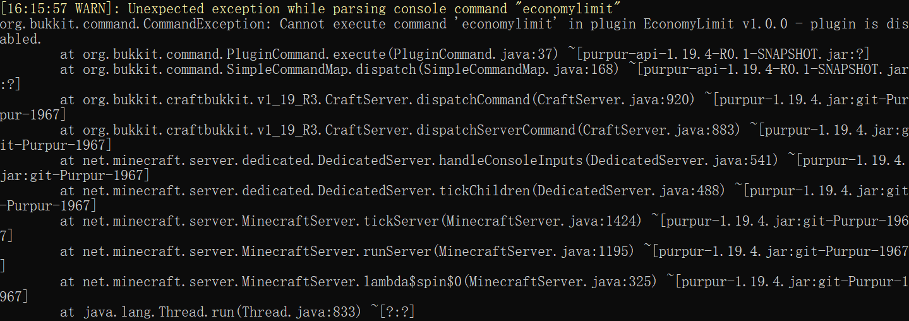

# 4.2 - 看报错

## 无用报错

在执行某个插件指令后出现一个类似下图的报错，即为无用报错，这里指的是这个插件在开服前就根本没有成功加载，导致插件指令没有成功注册的报错而已，此时你应该提供开服时此插件的报错。

## YAML 报错

在 2.1 节我已经介绍过了怎么解决。

.png>)

## 空指针

报错第一行带有 NullPointerException，这一般是插件没有考虑到特殊情况导致的报错，或者是插件某个依赖没有打包好，又或者前置插件版本过低了等等，建议联系开发者是最佳解决渠道。

.png>)

## 缺少前置插件

缺少的插件名字在第一行已经用 `[ ]` 符号标注，例如这里是 **NexEngine**。

.png>)

## 某个插件的红色提示消息

这不是报错，很多人认为是报错。

## 带有 Spawn entity 的黄色提示消息

这不是报错，很多人认为是报错。可以在 `spigot.yml` 中关闭，我只指路。

## 出现在插件提示 Checking update 等字样后的报错

只是国内特殊情况导致插件无法处理更新请求的报错，无视或者在插件配置文件关闭插件检查更新选项。
