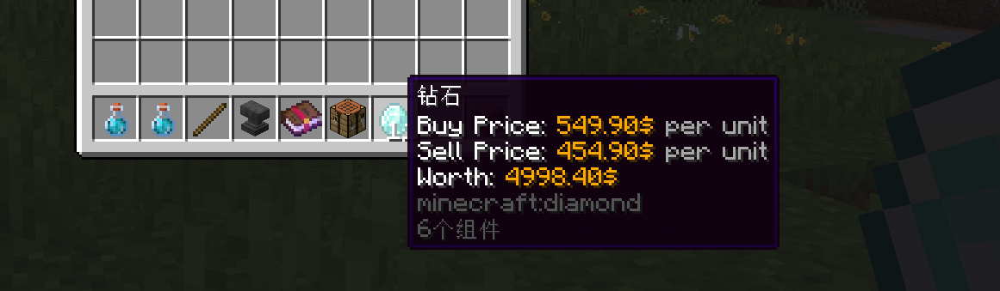

# 💰Products Config: Single Thing

## Products Config: Single Thing

This page explains the `products`, `buy-prices`, and `sell-prices` sections in a way that matches how the plugin actually works in code.

If you only remember one idea, remember this:

* A **single thing** is one entry under `products`, `buy-prices`, or `sell-prices`.
* A product can have many single things.
* The plugin decides which single things are usable, calculates their amount, checks requirements, and then gives/takes them.

### 1. What Is a Single Thing?

Inside one shop item, these three sections are all made of single things:

* `products`: What the player receives when buying, and what the player must provide when selling.
* `buy-prices`: What the player must pay to buy.
* `sell-prices`: What the player receives after selling.

Example:

```yaml
items:
  A:
    products:
      1:
        material: emerald
      2:
        material: diamond
    buy-prices:
      1:
        economy-plugin: Vault
        amount: 100
        placeholder: '{amount}$'
    sell-prices:
      1:
        economy-plugin: Vault
        amount: 20
        placeholder: '{amount}$'
```

In this example:

* `products.1` is a single thing
* `products.2` is a single thing
* `buy-prices.1` is a single thing
* `sell-prices.1` is a single thing

### 2. How the Plugin Uses Single Things

When a player buys or sells, the plugin does not just read the section from top to bottom. It follows this logic:

1. It reads all single things in `products`, `buy-prices`, or `sell-prices`.
2. It filters them by `apply-conditions` or legacy `conditions`.
3. It uses the section mode (`ANY`, `ALL`, `CLASSIC_ANY`, `CLASSIC_ALL`) to decide which single things are selected.
4. It calculates the real amount of each selected single thing.
5. It checks whether the player has enough of that thing.
6. It checks `require-conditions`.
7. It runs `give-actions` / `take-actions` and gives or takes the thing itself.

This is why `apply-conditions` and `require-conditions` are not the same thing.

### 3. The Difference Between `apply-conditions` and `require-conditions`

This is the most important part of the whole system.

#### `apply-conditions`

`apply-conditions` decides whether this single thing should be included in the transaction at all.

If the condition is not met:

* the single thing is ignored
* it is not selected
* it does not affect price/product calculation

This is useful for:

* VIP-only price tiers
* seasonal products
* different rewards for different players
* different prices based on permissions or placeholders

Example:

```yaml
products:
  1:
    material: PAPER
    amount: 1
  2:
    material: PAPER
    amount: 2
    apply-conditions:
      1:
        type: permission
        permission: group.vip
```

Result:

* normal players use `products.1`
* VIP players can also use `products.2`

#### `require-conditions`

`require-conditions` does not decide whether the single thing is selected. It decides whether the transaction is allowed to continue after that single thing has already been chosen and its amount has already been calculated.

If the condition is not met:

* the transaction is blocked
* the product/price was selected, but it cannot be used

This is useful for:

* requiring a permission before paying or receiving a specific thing
* blocking a reward unless a player meets an extra rule
* stopping a transaction when a calculated amount should only work in some cases

Example:

```yaml
buy-prices:
  1:
    economy-plugin: Vault
    amount: 50
    placeholder: '{amount}$'
    require-conditions:
      1:
        type: permission
        permission: shop.buy.special
```

Result:

* this price can still be selected
* but the purchase fails if the player does not have `shop.buy.special`

#### Legacy `conditions`

In code, `conditions` is treated as a legacy alias of `apply-conditions`.

That means:

* `conditions` = old style apply condition
* `apply-conditions` = clearer new name
* `require-conditions` = a different check with different behavior

If you want the single thing to be skipped, use `apply-conditions`. If you want the transaction to fail, use `require-conditions`.

### 4. Single Thing Types

The plugin determines the type of a single thing from the options you put inside it.

#### Vanilla Item

Use normal item format.

```yaml
products:
  1:
    material: emerald
  2:
    material: diamond
    amount: 16
```

Use this when:

* the thing is a normal Minecraft item
* you want the plugin to compare, give, or take an actual item

#### Hook Item

Use custom items from supported plugins.

```yaml
products:
  1:
    hook-plugin: MMOItems
    hook-item: 'AXE;;MAGIC_AXE'
```

Use this when:

* the thing is provided by another item plugin
* you still want UltimateShop to treat it like an item

#### Match Item

Use custom item matching rules.

```yaml
products:
  1:
    match-item:
      contains-lore:
        - 'Magic Flight Paper'
    amount: 64
```

Use this when:

* there is no exact item ID to compare
* you want to match by lore, NBT, name, or other custom rules

#### Vanilla Economy / Hook Economy

Use an economy balance instead of an item.

```yaml
buy-prices:
  1:
    economy-plugin: Vault
    amount: 15
    placeholder: '{amount}$'
```

Use this when:

* the player should pay or receive money, points, exp, levels, etc.

#### Custom

Use `match-placeholder` when the thing is not a normal item or supported economy.

```yaml
buy-prices:
  1:
    match-placeholder: '%player_health%'
    amount: 5
    placeholder: '{amount} Health'
    take-actions:
      1:
        multi-once: true
        type: console_command
        command: 'health take {player} {amount}'
```

Use this when:

* you want to compare any custom numeric value
* the plugin does not natively support that currency or system

Important:

* the placeholder is used to read how much the player currently has
* `take-actions` / `give-actions` are what actually modify that value

#### Free / Empty

If a single thing does not define item data, economy data, `match-item`, or `match-placeholder`, it is treated as free.

This is useful for:

* command shops
* permission shops
* action-only rewards

### 5. Which Sections Are Optional?

#### `products`

Optional.

If `products` does not exist:

* buying can still run `buy-actions`
* selling can still run `sell-actions`
* but the player will not receive any product on buy
* and will not need to provide any product on sell

This is useful for command shops.

#### `buy-prices`

Optional, but if it does not exist, the product cannot be bought.

#### `sell-prices`

Optional, but if it does not exist, the product cannot be sold.

### 6. Common Options for Single Things

These options are the most important ones users actually work with.

#### `amount`

The base amount of the single thing.

This can be:

* a fixed number
* a PlaceholderAPI value
* a math expression
* a dynamic formula

Example:

```yaml
amount: '55 + ({buy-times-server} - {sell-times-server}) * 0.1'
```

#### `apply-conditions`

Whether this single thing should participate in the transaction.

#### `require-conditions`

Whether the transaction is allowed to use this single thing after selection.

#### `give-actions`

Actions that run when this single thing is given to the player.

Typical uses:

* command shop rewards
* permission rewards
* custom currency rewards

#### `take-actions`

Actions that run when this single thing is taken from the player.

Typical uses:

* taking a custom currency
* running a command cost
* syncing with another plugin

#### `give-item`

Only useful for product-like item rewards.

If set to `false`, the plugin will not give the actual item, but `give-actions` can still run.

This is how most command shops work.

#### `take`

If set to `false`, the single thing is still checked as a requirement, but it is not actually removed.

This is useful when you want:

* a required item
* but not an item that gets consumed

### 7. Price-Only Options

These options mainly matter in `buy-prices` and `sell-prices`.

#### `placeholder`

The display name used in price placeholders like `{price}`.

```yaml
placeholder: '{amount}$'
```

For prices, this should usually always be set.

#### `start-apply`, `end-apply`, `apply`

These control when a price applies.

They are mainly meaningful in non-classic price modes:

* `ANY`
* `ALL`

Use them when you want:

* early purchases to be cheap
* later purchases to be expensive
* specific purchase counts to use a specific price

#### `min-amount` and `max-amount`

These clamp the final dynamic amount.

Use them when:

* your price formula can become too small
* your price formula can become too large

Example:

```yaml
buy-prices:
  1:
    economy-plugin: Vault
    amount: '55 + {buy-times-player} * 0.5'
    min-amount: 55
    max-amount: 500
    placeholder: '{amount}$'
```

### 8. About Modes: `ANY`, `ALL`, `CLASSIC_ANY`, `CLASSIC_ALL`

You do not need to understand every detail to use them, but this mental model helps:

* `ANY`: one applicable single thing is used each time, and dynamic apply ranges can matter per quantity
* `ALL`: all applicable single things are used each time
* `CLASSIC_ANY`: one applicable single thing is used, but treated more like a fixed bundle
* `CLASSIC_ALL`: all applicable single things are used as a fixed bundle

Practical advice:

* use `CLASSIC_ALL` for simple fixed-price shops
* use `CLASSIC_ANY` for "pick one valid reward/price" setups
* use `ANY` / `ALL` only when you need apply ranges or more advanced dynamic behavior

### 9. Shared Condition Keys

The plugin also supports shared apply-condition sections through `config.yml`:

```yaml
conditions:
  products-key: 'products-conditions'
  buy-prices-key: 'buy-prices-conditions'
  sell-prices-key: 'sell-prices-conditions'
  display-item-key: 'display-item-conditions'
```

That lets you write:

```yaml
products:
  one:
    material: REDSTONE
  two:
    material: IRON_INGOT

products-conditions:
  one:
    1:
      type: placeholder
      placeholder: '{random_daily}'
      rule: '=='
      value: 'A'
  two:
    1:
      type: placeholder
      placeholder: '{random_daily}'
      rule: '=='
      value: 'B'
```

Important:

* these shared keys are for apply conditions
* `require-conditions` is still configured inside the single thing itself

### 10. Two Very Common Patterns

#### Pattern A: Normal item shop

```yaml
A:
  price-mode: CLASSIC_ALL
  product-mode: CLASSIC_ALL
  products:
    1:
      material: APPLE
      amount: 64
  buy-prices:
    1:
      economy-plugin: Vault
      amount: 150
      placeholder: '{amount}$'
  sell-prices:
    1:
      economy-plugin: Vault
      amount: 30
      placeholder: '{amount}$'
```

This is the simplest setup:

* buying gives apples
* buying costs money
* selling takes apples
* selling gives money

#### Pattern B: Command shop

```yaml
A:
  price-mode: CLASSIC_ALL
  product-mode: CLASSIC_ALL
  display-item:
    name: 'Magic Crate Key'
    material: PAPER
    custom-model-data: 500
    amount: 1
  products:
    1:
      material: PAPER
      custom-model-data: 500
      amount: 1
      give-item: false
      give-actions:
        1:
          multi-once: true
          type: console_command
          command: "crate give {player} magic {amount}"
  buy-prices:
    1:
      economy-plugin: Vault
      amount: 150
      placeholder: '{amount}$'
```

Why this works:

* the product exists so the plugin has something to process
* `give-item: false` stops the fake item from being given
* `give-actions` gives the real reward by command

### 11. When Should I Put Logic on the Item, and When on the Single Thing?

Use single thing logic when the rule belongs to one specific price or reward.

Good examples:

* one VIP reward among several rewards
* one seasonal price among several prices
* one command reward that should only run in one branch

Use item-level logic like `buy-actions`, `sell-actions`, `buy-conditions`, `sell-conditions` when the rule should apply to the whole product no matter which single thing was selected.

### 12. Best Practices

* Start with `CLASSIC_ALL` unless you really need advanced behavior.
* Use `apply-conditions` to choose a branch.
* Use `require-conditions` to block a transaction.
* Use `give-item: false` for command shops.
* Use `take: false` when something should be required but not consumed.
* Keep prices and rewards small and explicit before adding dynamic formulas.
* If you use dynamic values, add `min-amount` and `max-amount` to avoid extreme results.

### 13. A Simple Rule of Thumb

If you are unsure which option to use:

* "Should this branch be ignored?" -> use `apply-conditions`
* "Should the transaction fail?" -> use `require-conditions`
* "Should the plugin give/take a real item?" -> use `give-item` or `take`
* "Should a command run when this single thing is used?" -> use `give-actions` / `take-actions`

That mental model is enough to build most shops correctly.

## Example: Command Shop

```yaml
  A:
    price-mode: CLASSIC_ALL
    product-mode: CLASSIC_ALL
    display-item:
      name: 'Magic Crate Key'
      material: PAPER
      custom-model-data: 500
      amount: 1
    buy-prices:
      1:
        economy-plugin: Vault
        amount: 150
        placeholder: '{amount}⛂'
    buy-actions: # In product config
      1:
        type: console_command
        command: "crate give {player} magic" # Put command here.
      2:
        multi-once: true # If you want to use {amount} placeholder in your give item command, make sure add this line to make sure this action only execute once when purchase multi quantity.
        type: console_command
        command: "crate give {player} magic {amount}" 
  B:
    price-mode: CLASSIC_ALL
    product-mode: CLASSIC_ALL
    products:
      1:
        name: 'Magic Crate Key'
        material: PAPER
        custom-model-data: 500
        amount: 1
        give-item: false # You need add this to make sure the "fake" product will not give to player
        give-actions: # In single things config
          1:
            type: console_command
            command: "crate give {player} magic"
          2:
            multi-once: true # If you want to use {amount} placeholder in your give item command, make sure add this line to make sure this action only execute once when purchase multi quantity.
            type: console_command
            command: "crate give {player} magic {amount}" 
    buy-prices:
      1:
        economy-plugin: Vault
        amount: 150
        placeholder: '{amount}⛂'
```

In the above two examples, the final execution effect is identical. But can you think of it? If combined with the `conditions` option, using the **give actions** method can enable different players to execute different conditions!

```yaml
  B:
    price-mode: CLASSIC_ALL
    product-mode: CLASSIC_ALL
    products:
      1:
        name: 'Magic Crate Key'
        material: PAPER
        custom-model-data: 500
        amount: 1
        give-item: false # You need add this to make sure the "fake" product will not give to player
        give-actions: # In single things config
          1:
            multi-once: true
            type: console_command
            command: "crate give {player} magic {amount}"
      2:
        name: 'Magic Crate Key (VIP plus 1 for free)'
        material: PAPER
        custom-model-data: 500
        amount: 1
        give-item: false # You need add this to make sure the "fake" product will not give to player
        give-actions: # In single things config
          1:
            multi-once: true
            type: console_command
            command: "crate give {player} magic {amount}"
        conditions:
          1:
            type: permission
            permission: group.vip
    buy-prices:
      1:
        economy-plugin: Vault
        amount: 150
        placeholder: '{amount}⛂'
```

## Alternative Options

* `products.XXX.conditions` can be replaced by `products-conditions` section.
* `buy(sell)-prices.XXX.conditions` can be replaced by `buy(sell)-prices-conditions` section.

For example,

```yaml
    products:
      1:
        material: REDSTONE
        amount: 1
    products-conditions:
      1: 
        type: placeholder
        placeholder: '{random_daily-1}'
        rule: '=='
        value: 'A'
```

is same as:

```yaml
    products:
      1:
        material: REDSTONE
        amount: 1
        conditions:
          1:
            type: placeholder
            placeholder: '{random_daily-1}'
            rule: '=='
            value: 'A'
```

Start from 3.4.3, you can customize the **keys** for conditions of **single things**. If you confirm that your products, buy prices, and sell prices are using same conditions at a time, you can set their keys to the same value, so that you don't have to configure their conditions separately for each single thing. You can find the settings at `config.yml` file like below:

```yaml
conditions:
  products-key: 'conditions'
  buy-prices-key: 'conditions'
  sell-prices-key: 'conditions'
  display-item-key: 'conditions'
```

This example make all `conditions` key be same, so the shop config should be also like:

```yaml
items:
  A:
    price-mode: CLASSIC_ANY
    product-mode: CLASSIC_ANY
    products:
      one:
        material: REDSTONE
        amount: 1
        give-actions:
          1:
            type: message
            message: 'Hello!'
      two:
        material: IRON_INGOT
        amount: 1
    sell-prices:
      one:
        economy-plugin: Vault
        amount: 1
        placeholder: '&6{amount} Coins'
        start-apply: 0
      two:
        economy-plugin: Vault
        amount: 3
        placeholder: '&6{amount} Coins'
        start-apply: 0
    conditions:
      one: # Condition ID
        1: # Means first condition
          type: placeholder
          placeholder: '{random_daily}'
          rule: '=='
          value: 'A'
      two:
        1:
          type: placeholder
          placeholder: '{random_daily}'
          rule: '=='
          value: 'B'
```

In this example, if condition **one** is meet, we will also use the product with ID **one** and sell price wth ID **one**.

For actions, it is recommended you use give-actions in each single thing instead of buy-actions or sell-actions, because their conditions are separate and cannot be synchronized with the conditions of a single thing, configuring them will be more complicated.

## Auto Display Price at Item Lore

* Download and install MythicChanger [here](https://www.spigotmc.org/resources/mythicchanger-auto-match-change-drag-change-gui-change-in-1-plugin-1-14-1-21-8.98523/). (This plugin requires packetevents)
* Create a new file called `shop-display.yml` in `plugins/MythicChanger/rules` folder.
* Copy those content in this file and restart the server.

```yaml
weight: 15

only-in-player-inventory: true

fake-changes:
  add-price-lore:
    - '&fBuy Price: &6{buy-price} &7per unit'
    - '&fSell Price: &6{sell-price} &7per unit'
    - '&fWorth: &6{total-price}'
```

<figure><figcaption></figcaption></figure>
